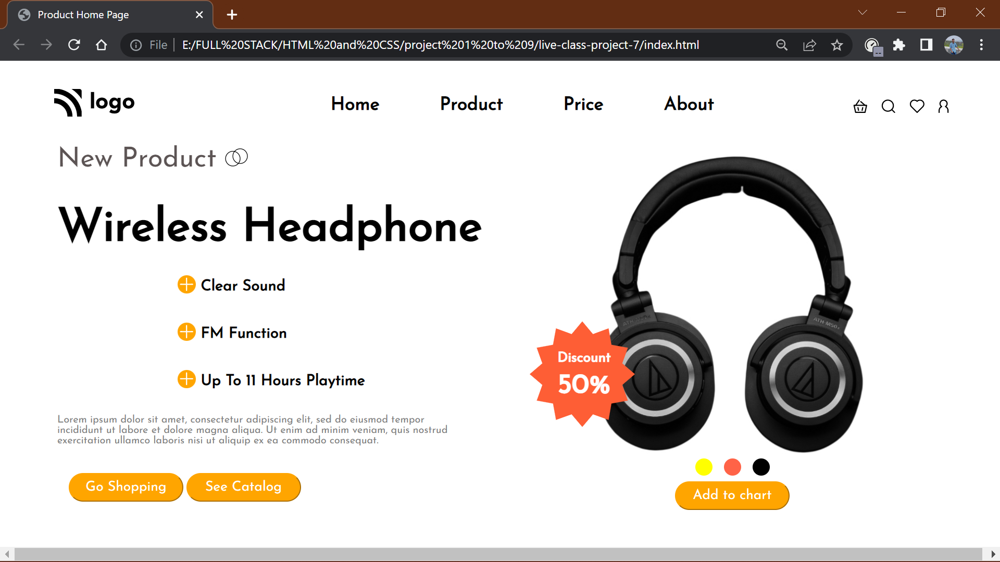

# ASSIGNMENT 7 USING HTML AND CSS

## NAME : NIRAJ VADHER 

In this project I was given the task to make a home page which should look like this

### Target:

### Result:

`ZOOM:67%`
## Learning
In this project i get to learn many thing like

- how to effectively use position to create this decorative webpages
- how to edit the buttons and add css to them
- how to overlap the images to make nice looking website
- how to add icons to web page

## Honest Time of compeletion of project
- `7 hours`

## Live link of project
 - [PROJECT 7]()